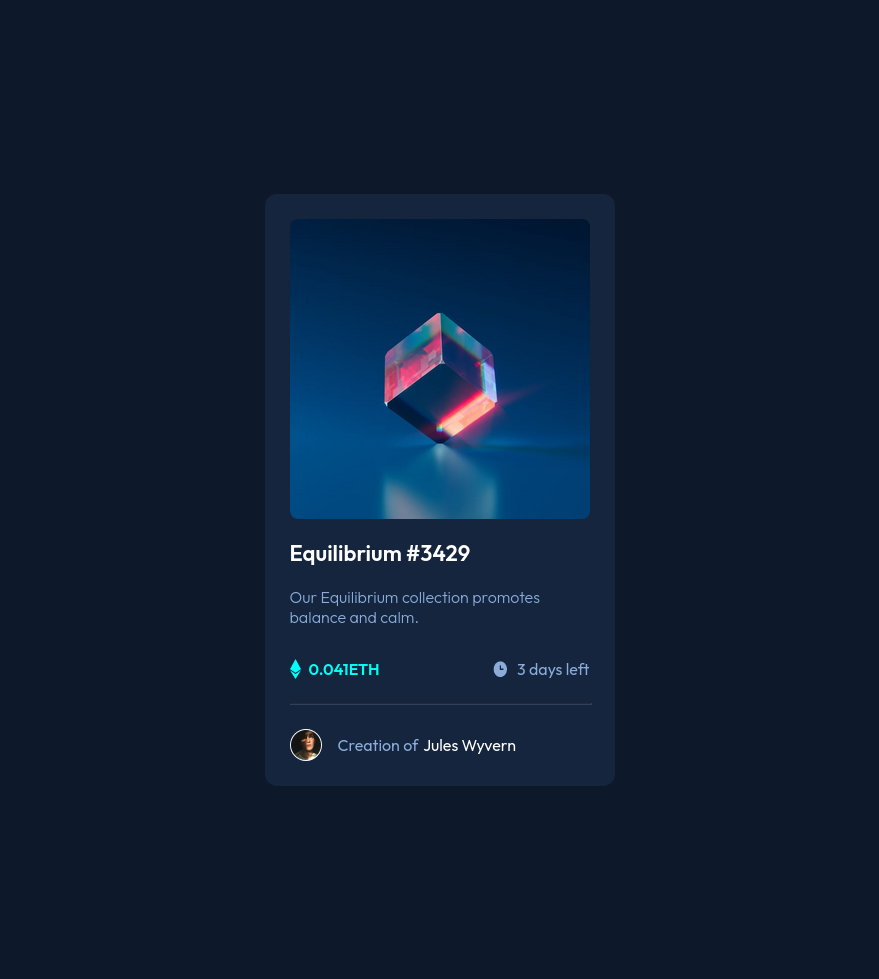

# Frontend Mentor - NFT preview card component solution

## Overview

- Overall this one I felt go pretty smooth until the end. I felt this one I did cleaner and used px a lot less.

### The challenge

- the challenge came when I wanted to add the eye. That took me some time to figure out. Then when I got it working I had a 4px mystery that I could not figure out for the life of me where it was coming from. Still not 100% sure why but it was a simple display: block; on my image that fixed it

### Screenshot

### What I learned

I learned the trick of overlaying an image on another.
